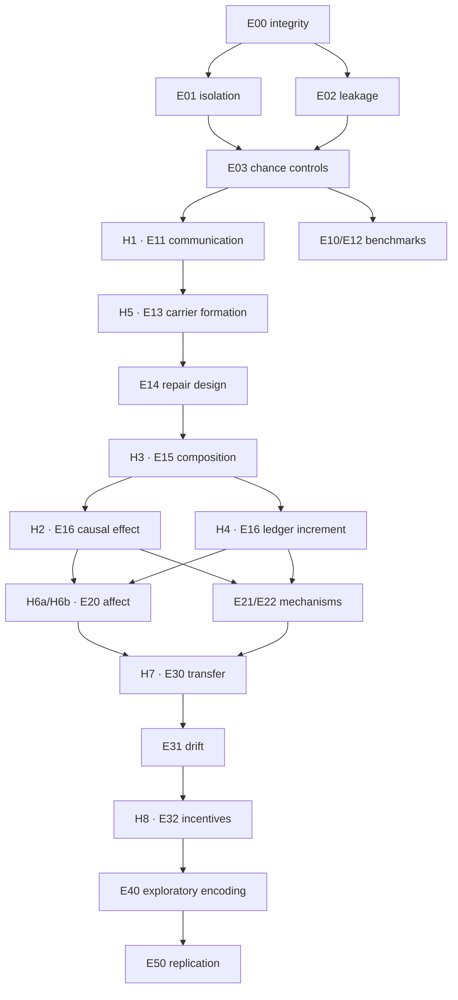

# Research Protocol Cards

Version: 1  
Frozen for D03: 2026-09-11 UTC  
Canonical machine-readable cards: `protocols/research-protocol-cards.v1.json`

These cards freeze the research questions, estimands, variable roles, and
confirmatory/secondary/exploratory separation. D04–D08 own the remaining scenario,
statistical, leakage, resource, and registration parameters. No card authorizes data
collection until its dependencies and external gates pass.

## Contribution boundary

The candidate contribution is the incremental predictive and audit value of
outcome-blind contemporaneous private semantic ledgers beyond transcript,
task-outcome, policy-state, ordinary-log, and signed-log comparators in controlled
emergent-communication studies. This is a question, not a result. The project does
not claim priority, human developmental equivalence, semantic truth from signatures,
zero leakage outside a registered bound, learned-cipher security, or causal
cross-architecture superiority.

The independent unit is an independently seeded training run. Episodes, turns,
messages, affect windows, and intervention cases are repeated observations nested in
a run. Analyses that treat those repeated observations as independent are invalid.

## Nonredundant ledger hypotheses

| Hypothesis | Distinct question | Estimand |
|---|---|---|
| H2: causal effect | Does a ledger-consistent message intervention cause the predicted receiver behavior? | Within-case change in receiver probability assigned to the ledger-predicted action, ledger-consistent substitution minus seed-matched shuffled valid message, holding receiver observation and pre-intervention policy state fixed |
| H4: incremental prediction | Does the pre-outcome ledger predict held-out intervention responses better than information already available without that ledger? | Paired improvement in a preregistered proper prediction score over the strongest eligible transcript-only, task-history, policy-state, random, and majority baseline |

H2 can succeed while H4 fails if the intervention is behaviorally effective but the
ledger adds no information beyond policy state or transcripts. H4 can succeed only
on untouched intervention cases using predictions committed before outcomes. The
same statistic cannot be reported for both hypotheses.

## Family-wise testing graph

E00–E03 are validity gates, not statistical hypotheses and not sources of reusable
alpha. The confirmatory family has nine members: H1, H2, H3, H4, H5, H6a, H6b, H7,
and H8. One preregistered p-value is produced per member, then Holm correction is
applied globally at family-wise alpha 0.05. A multi-component directional hypothesis
uses the maximum component p-value and requires every component direction and
practical threshold. Missing or invalid prerequisite evidence yields `not-tested`,
never a favorable p-value.

Arrows represent validity/design dependencies, not alpha recycling and not a demand
that every upstream effect be positive before a downstream null result may be
reported. If H1 fails, later form or structure outcomes cannot be interpreted as
useful communication, even if their descriptive analyses are complete.

## Protocol-card index

| ID | Class | Primary question / outcome | Locked estimand | Later design owner |
|---|---|---|---|---|
| E00 | Qualification | Evidence integrity / verifier disposition | Mutation-class detection and unchanged-bundle acceptance | D06 |
| E01 | Qualification | Side-route isolation / prohibited receiver delivery | Delivery count and class-specific detector sensitivity | D06 |
| E02 | Qualification | Observation leakage / held-out target prediction | Probe advantage over chance and upper bound | D04, D06 |
| E03 | Qualification | Chance controls / seed success | Five equivalence decisions, oracle adequacy, paired separation | D05 |
| E10 | Secondary benchmark | Frozen-model external protocol / held-out success | Descriptive success and intervention contrasts | D04, D07 |
| E11 | Confirmatory H1 | Recurrent RL communication / held-out success | Normal minus four seed-paired trained-policy controls | D04, D05, D07 |
| E12 | Secondary benchmark | Reward-free protocol / prediction and task success | Within-architecture loss ablation; cross-track descriptive difference | D04, D07 |
| E13 | Confirmatory H5 | Blank-carrier forms / stability and convergence | Stable-form minimum plus blank-versus-token time ratio | D04, D05 |
| E14 | Secondary | Dialogue repair / successful bounded repair | Paired repair probability and restricted mean turns | D04, D05 |
| E15 | Confirmatory H3 | Composition / untouched-combination success | 32-symbol/4-token minus 128-symbol/8-token seed effect | D04, D05 |
| E16 | Confirmatory H2/H4 | Causal listening and ledger validity | Causal action-probability change; held-out proper-score increment | D05, D06 |
| E20 | Confirmatory H6a/H6b | Affect utility and leakage / repair time and excess CMI | Repair contrast; one-sided 0.02-bit leakage upper bound | D05, D06 |
| E21 | Secondary benchmark | Learning mechanisms / success, listening, ledger prediction | Within-track ablations; cross-architecture descriptive differences | D04, D07 |
| E22 | Secondary | Plasticity/curriculum / acquisition and stability | Schedule contrasts under equal exposure and update budgets | D04, D05, D07 |
| E30 | Confirmatory H7 | Partner transfer / replacement degradation | Fixed-dyad minus eight-partner degradation | D04, D05, D07 |
| E31 | Secondary | Longitudinal stability / drift and replay | Within-seed trajectory with between-seed variation and selection accounting | D04, D05 |
| E32 | Confirmatory H8 | Incentives / informativeness and ambiguity | Aligned-to-conflicting paired two-direction conjunction | D04, D05, D06 |
| E40 | Exploratory | Ephemeral encoding / recovery and utility | Threat-model-specific descriptive recovery differences | D04, D06, D07 |
| E50 | Replication | Reproducibility / frozen finding-specific rule | New-seed replication estimate for each designated primary finding | D07, D08 |

## Outcome hierarchy by experiment

Qualification outcomes determine whether later evidence is valid. Confirmatory
outcomes enter the global nine-member family. Secondary outcomes receive effect
sizes and uncertainty but no confirmatory language. Exploratory outcomes are labeled
and use false-discovery-rate summaries only within clearly declared exploratory
families.

| ID | Confirmatory | Secondary | Exploratory |
|---|---|---|---|
| E00 | None; deterministic acceptance | Verification latency, bytes, simulated-commitment overhead | None |
| E01 | None; deterministic acceptance | Rejection timing and audit completeness | Unanticipated route taxonomy |
| E02 | None; validity bound | Post-restore stability and field attribution | Nonlinear probe sensitivity |
| E03 | None; qualification decisions | Tail and invalid-run sensitivity | None |
| E10 | None | Success, compliance, intervention effects, convention time | Form structure |
| E11 | H1 | Sample efficiency, utilization, variance, signaling | Form clusters |
| E12 | None | Prediction, success, listening, reuse | Representation geometry |
| E13 | H5 | Success, reuse, modification, acquisition, generalization, capacity | Form families and transformation motifs |
| E14 | None | Repair probability/time, symmetry, transfer, cost | Unprompted repair constructions |
| E15 | H3 | Seen success, reuse, topology, part/order effects | Additional bandwidth levels |
| E16 | H2 and H4 | Signaling, other interventions, calibration, explanation gap | Ledger disagreement before repair |
| E20 | H6a and H6b | Convergence, success, covert-channel detector power | Mapping-specific trajectories |
| E21 | None | Mechanism and ablation comparisons | Trajectory clustering |
| E22 | None | Acquisition, stability, generalization, drift | Nonlinear phase transitions |
| E30 | H7 | Other partner types, recovery, ledger-assisted adaptation | Partner-specific form clusters |
| E31 | None | Drift, replay, revisions, entropy, derived rollback | Change points |
| E32 | H8 | Agreement, utilities, operational deception indicators | Incentive-linked compression and drift |
| E40 | None | Recovery, utility, integrity, instance novelty | Encoding dynamics |
| E50 | Frozen replication targets | Reproduction and heterogeneity | Operator/deployment sensitivity |

## D03 completion check

The JSON is the canonical source and must contain exactly the 19 notebook experiment
IDs and nine confirmatory hypotheses. `pnpm audit:protocol-cards` verifies coverage,
dependency references, class labels, required fields, H2/H4 nonidentity, family
membership, and synchronization with the experiment notebook. Changing a frozen
question, estimand, outcome class, or family rule requires a dated protocol amendment;
after outcome access it cannot be relabeled confirmatory.
